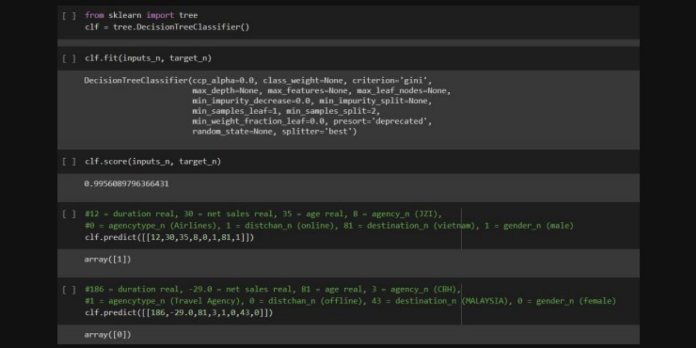

# Travel Insurance Analysis using Python Programming Language
This is a group final project on our Coding and Big Data course and I worked it on with my other 4 friends. In this project, we aimed to do a travel insurance analysis using a travel insurance.csv dataset that we got from Kaggle and we also tried to visualize it using Power BI to make it easier to understand. 

From this dataset, we want to know how much travel insurance is used for travelers in traveling and we also want to find out whether someone will use travel insurance or not based on several factors or inputs that are given. In this project, we try to solve the problem using the decision tree model with a python programming language and its several libraries such as numpy, pandas, and scikit-learn.

From our predictions, we hope that we can help travelers to make a decision whether they need to use travel insurance for their trip or not based on some of the factors or inputs that the traveler has.

For more detail about our final project, you may download and read our presentation slides that I have already attached within this repository. 

